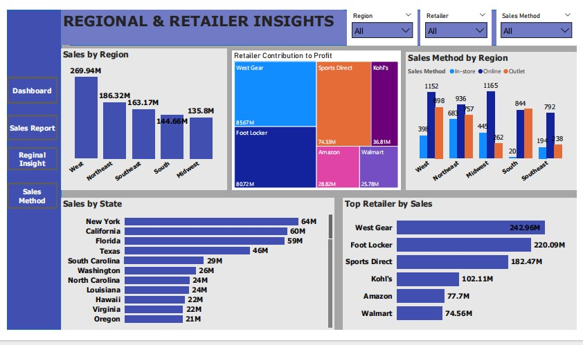

# Adidas-Sales-Analysis

# 📌 Project Overview

This project analyzes Adidas’ sales performance across time, regions, products, retailers, and sales channels. The goal is to uncover insights into sales growth, profitability, and customer behavior, and provide recommendations for improving business performance.

# ⚙️ Tools & Technologies

- Power BI → For building interactive dashboards and data visualizations.

- Excel/CSV → Data source cleaning and preparation.

- GitHub → For project documentation and sharing.

# ❓ Why Power BI Instead of Python?

Although the internship project guideline suggested Python, I selected Power BI for this phase of analysis because:

-  I had not yet fully learned Python for data analysis and visualization.

- Power BI allowed me to quickly clean, transform, and visualize data in an interactive way.

- The project focus was on business insights, and Power BI dashboards are effective for presenting them clearly.

- Power BI supports real-time visual storytelling, which is ideal for management-level presentations.

👉 Python remains a tool I intend to learn and apply in future projects, but Power BI was the most practical choice for this internship task.

# 🔄 Process Taken

### 1. Data Collection

- Obtained Adidas sales dataset (CSV/Excel format).

### 2. Data Cleaning & Transformation

- Checked for missing values and formatting errors.

- Standardized date, region, and sales method fields.

- Converted numerical columns to correct data types.

### 3. Data Modeling

- Built relationships between fact tables (sales) and dimension tables (location and calendar).

- Created calculated measures (e.g., YoY growth, margin, total profit).

### 4. Visualization in Power BI

#### Designed 4 dashboards:

- Main Sales Overview

- Regional & Retailer Insights

- Product & Profitability Analysis

- Sales Method & Channel Effectiveness

### 5. Insight Generation

- Interpreted visual results into business insights.

- Compared across regions, retailers, and sales channels.

### 6. Documentation

Prepared report and recommendations. 

# 📈 Dashboard Overview

### Insights

- Total Sales: $899.9M | Units Sold: ~2M | Operating Profit: $332.1M.

- YoY Growth: +394% (2020 → 2021).

- Online is the top channel ($356.6M).

- Men’s Street Footwear leads products ($209M).

- West region dominates ($269.9M).

# Regional & Retailer Insights

### Insights

- West ($269.9M) and Northeast ($186.3M) are strongest regions.

- Top states: New York ($64M), California ($60M), Florida ($59M).

- Top retailers: West Gear, Foot Locker, Sports Direct.

- Amazon & Walmart underperform.

# Product & Profitability Analysis

#### Insights

- Men’s footwear highest sales & profit.

- Margins improved (0.404 → 0.426)

- Women’s Apparel & Footwear show growth potential.

# Sales Method & Channel Effectiveness

#### Insights

In-store: most profitable ($127.6M).

Online: fastest-growing channel (from $4.8M → $262.7M).

Online sold the most units (939K).

# 🎯 Recommendations

- Online Optimization → Reduce fulfillment costs and introduce premium online-only products.

- Regional Expansion → Target Midwest & South with localized campaigns.

- Product Mix → Strengthen Women’s Apparel & Footwear to balance dominance of Men’s Footwear.

- Channel Balance → Grow online volume while preserving margins in in-store/outlet sales.

- Retailer Partnerships → Deepen ties with West Gear & Foot Locker; refine Amazon/Walmart strategy.

- Rush Hour Strategy → Ensure adequate staffing and inventory allocation during peak demand periods to maximize sales and customer satisfaction.

# 📌 Conclusion

The analysis reveals that Adidas’ sales boom in 2021 was driven by online sales, Men’s Footwear, and strong performance in the West region. To sustain growth, Adidas must optimize profitability, strengthen underperforming regions, and balance product strategies across genders and categories.

